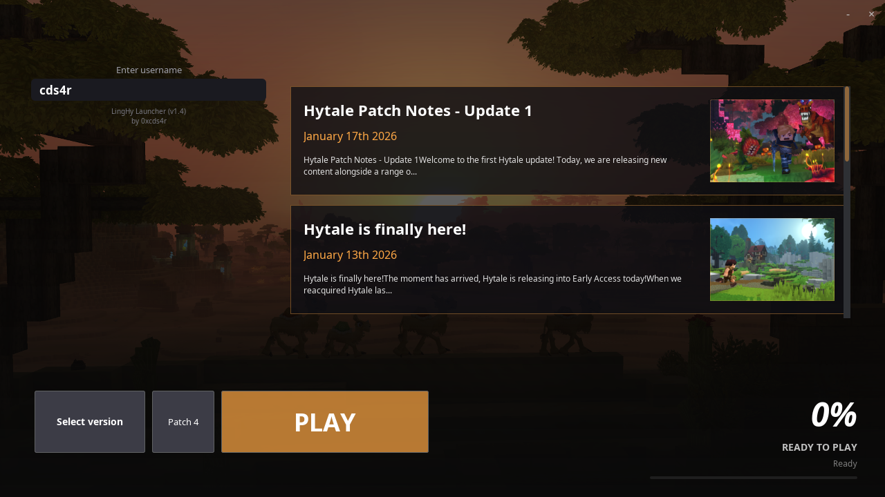
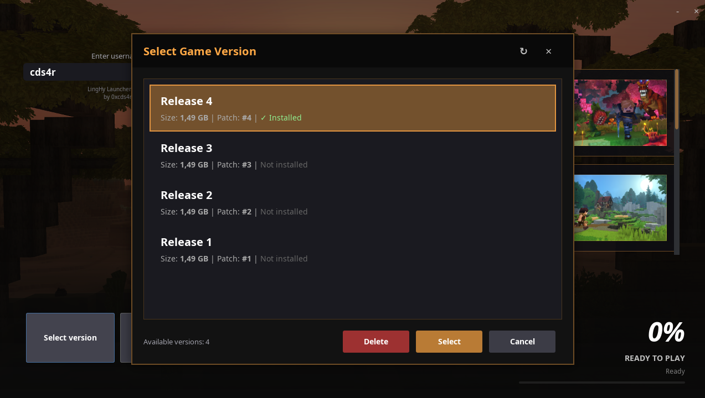
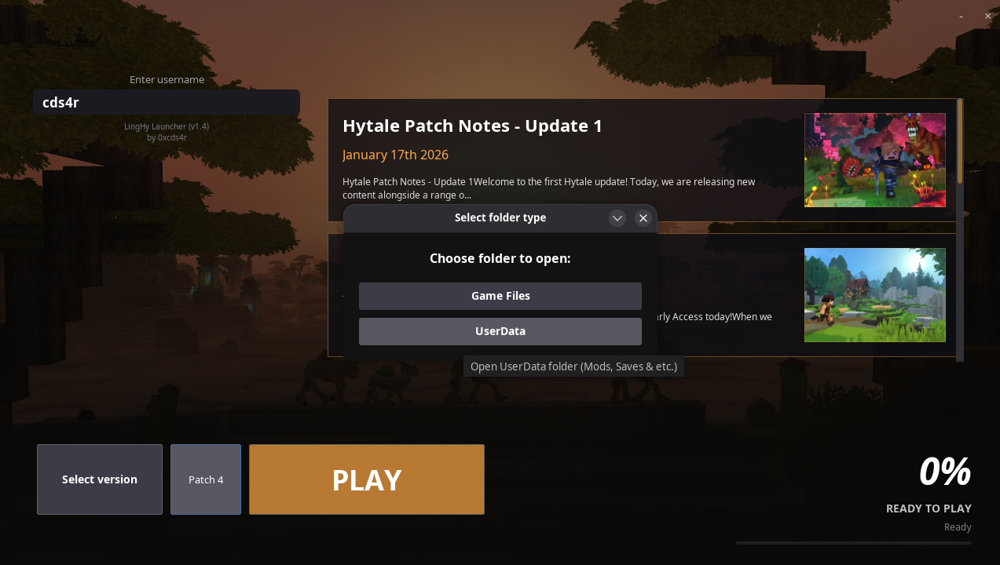

## LingHy Launcher for Hytale by 0xcds4r

v1.0:
- Installing and launching the basic version of the game
- Basic launcher interface with news
- Minor bugs

v1.2:
- Added version manager
- Added 'open game folder'
- News loop-loading bug-fix
- Optimize code

v1.4:
- Now we is LingHy Launcher :)
- Now is launcher main folder is '~/.hytale'
- Updated background
- Updated news section GUI
- Update version selector GUI
- Fixed news section scroll
- Added UUID generator
- Added folder selector for open (Game Files/UserData)
- Optimize code

### Screenshots:

